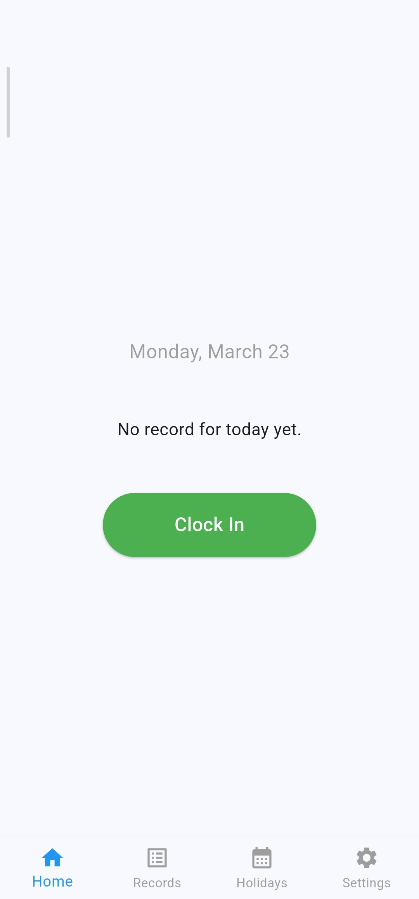
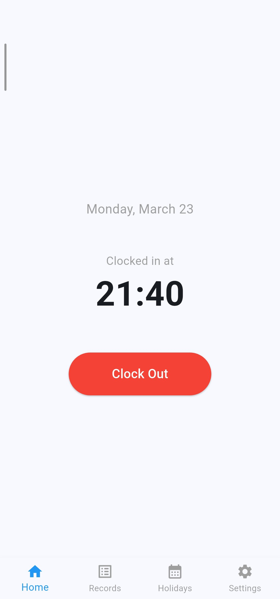
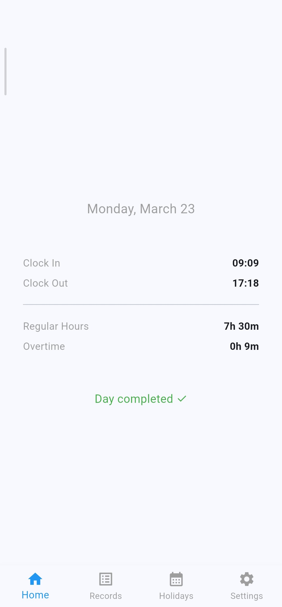
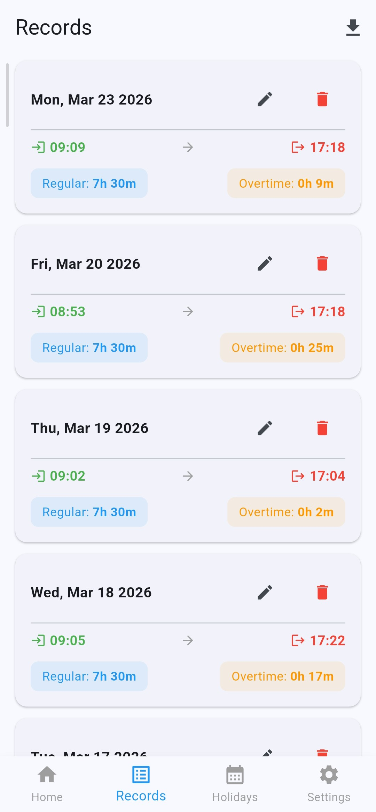
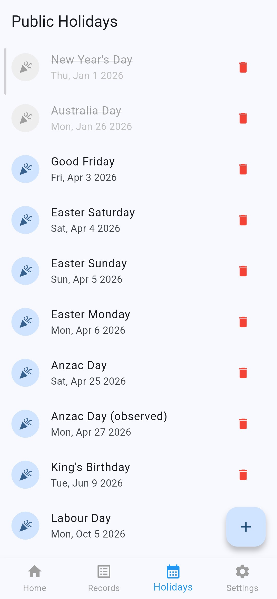
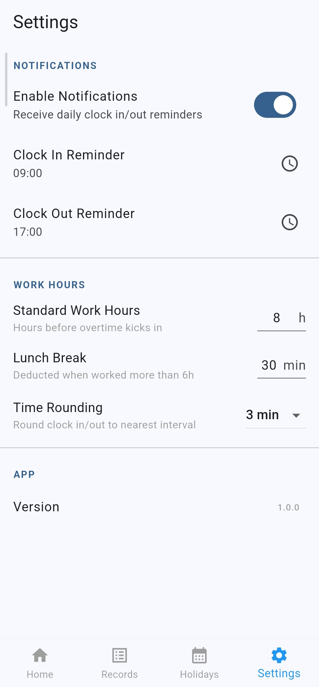

# Clock In

A Flutter mobile application for tracking daily work attendance. The app sends scheduled notifications on weekdays (excluding public holidays) to remind the user to clock in and out, automatically calculating total hours worked and overtime.

---

## Screenshots


<p float="left">
    
    
    
    
    
    
</p>


---

## Features

- Scheduled weekday notifications for clock in and clock out
- Notifications survive device restarts and work with app closed (via WorkManager)
- One-tap clock in / clock out from the home screen
- Configurable time rounding for clock in/out (3, 5, 10, 15, or 30 min intervals)
- Automatic calculation of total hours worked and overtime
- Lunch break deducted automatically from total hours (only when worked > 6 hours)
- NSW public holidays pre-loaded (2026–2027)
- Full record editing in case the user missed clocking in or out
- CSV export with date range filter
- Holidays management screen (add / delete)
- Configurable settings: notification times, standard work hours, lunch break duration, time rounding

---

## Tech Stack

| Layer | Technology |
|---|---|
| Framework | Flutter (Dart) |
| Local Database | SQLite via `sqflite` |
| Background Tasks | `workmanager` |
| Notifications | `flutter_local_notifications` |
| Date Formatting | `intl` |
| Timezone Support | `timezone`, `flutter_timezone` |
| CSV Export | `csv`, `path_provider`, `share_plus` |
| Battery Exemption | `android_intent_plus`, `device_info_plus` |

---

## Project Structure

```
lib/
├── main.dart
├── database/
│   └── database_helper.dart          # SQLite CRUD operations and initialization
├── models/
│   ├── record.dart                   # Work record entity
│   ├── holiday.dart                  # Public holiday entity
│   └── setting.dart                  # App setting entity
├── screens/
│   ├── main_navigation.dart          # Bottom navigation bar
│   ├── home_screen.dart              # Clock in/out UI and daily summary
│   ├── records_screen.dart           # Record history, editing and CSV export
│   ├── holidays_screen.dart          # Holiday management
│   └── settings_screen.dart          # App configuration
├── services/
│   ├── notification_service.dart     # Notification plugin initialization
│   ├── work_notification_service.dart # WorkManager background scheduling
│   └── export_service.dart           # CSV export logic
└── utils/
    └── time_calculator.dart          # Hours, overtime and time rounding logic
```

---

## Database Schema

### `records`
| Column | Type | Description |
|---|---|---|
| id | INTEGER PK | Auto-incremented identifier |
| date | TEXT | Work date `yyyy-MM-dd` |
| start_time | TEXT | Clock in time `HH:mm` |
| end_time | TEXT | Clock out time `HH:mm` |
| total_hours | REAL | Regular hours worked (excluding overtime) |
| otime_hours | REAL | Overtime hours above standard |
| timestamp | TEXT | ISO 8601 record creation time |

### `holidays`
| Column | Type | Description |
|---|---|---|
| id | INTEGER PK | Auto-incremented identifier |
| name | TEXT | Holiday name |
| date | TEXT | Holiday date `yyyy-MM-dd` |
| timestamp | TEXT | ISO 8601 record creation time |

### `settings`
| Column | Type | Description |
|---|---|---|
| id | INTEGER PK | Auto-incremented identifier |
| key | TEXT UNIQUE | Setting identifier |
| value | TEXT | Setting value |
| timestamp | TEXT | ISO 8601 last updated time |

---

## Default Settings

| Key | Default | Description |
|---|---|---|
| `checkin_notification_time` | `08:00` | Morning notification time |
| `checkout_notification_time` | `17:00` | Afternoon notification time |
| `standard_work_hours` | `8` | Hours before overtime kicks in |
| `lunch_break_minutes` | `30` | Lunch break deducted from total |
| `work_days` | `1,2,3,4,5` | Monday to Friday |
| `notifications_enabled` | `true` | Master notification switch |
| `time_rounding_minutes` | `0` | Clock in/out rounding interval (0 = off) |

---

## Hours Calculation Logic

```
raw_hours     = end_time - start_time
lunch_deduct  = lunch_break_minutes / 60  (only if raw_hours > 6)
otime_hours   = max(0, raw_hours - standard_work_hours)
total_hours   = raw_hours - lunch_deduct - otime_hours
```

Example:
```
start_time    = 08:00
end_time      = 17:30
lunch_break   = 30 min
standard      = 8h

raw_hours     = 9.5h
otime_hours   = max(0, 9.5 - 8.0) = 1.5h
total_hours   = 9.5 - 0.5 - 1.5   = 7.5h
```

---

## Time Rounding

When enabled, clock in/out times are rounded to the nearest multiple of 5 minutes before saving. The tolerance setting defines the maximum distance allowed for rounding to apply.

```
tolerance = 3 min
07:58 → 08:00  (2 min from 08:00 ≤ 3) ✓
08:03 → 08:00  (3 min from 08:00 ≤ 3) ✓
08:08 → 08:10  (2 min from 08:10 ≤ 3) ✓
08:06 → 08:05  (1 min from 08:05 ≤ 3) ✓
```

Available tolerances: Off, 3, 5, 10, 15, 30 minutes.

---

## Notification Architecture

Notifications are scheduled via **WorkManager** rather than `flutter_local_notifications` `zonedSchedule`. This ensures reliable delivery on all Android versions including MIUI devices, even when the app is closed or the device is idle.

Each notification task:
1. Checks if the current day is a weekend or NSW public holiday — skips if so
2. Shows the notification via `flutter_local_notifications`
3. Reschedules itself for the next working day at the same time

On Android 12+, the app requests battery optimization exemption on first launch to prevent the system from deferring WorkManager tasks.

---

## Android Permissions

```xml
<uses-permission android:name="android.permission.RECEIVE_BOOT_COMPLETED"/>
<uses-permission android:name="android.permission.POST_NOTIFICATIONS"/>
<uses-permission android:name="android.permission.FOREGROUND_SERVICE"/>
<uses-permission android:name="android.permission.FOREGROUND_SERVICE_DATA_SYNC"/>
<uses-permission android:name="android.permission.REQUEST_IGNORE_BATTERY_OPTIMIZATIONS"/>
<uses-permission android:name="android.permission.SCHEDULE_EXACT_ALARM" android:maxSdkVersion="32"/>
<uses-permission android:name="android.permission.USE_EXACT_ALARM"/>
```

---

## Getting Started

### Prerequisites

- Flutter SDK >= 3.5.0
- Android Studio with Android SDK
- Physical device or emulator running Android 8.0+ (API 26+)

### Run

```bash
flutter pub get
flutter run
```

---

## Dependencies

```yaml
sqflite: ^2.3.0
path: ^1.9.0
workmanager: ^0.9.0+3
flutter_local_notifications: ^20.1.0
flutter_timezone: ^5.0.1
timezone: ^0.9.0
intl: ^0.19.0
csv: ^6.0.0
path_provider: ^2.1.0
share_plus: ^10.0.0
android_intent_plus: ^5.0.0
device_info_plus: ^10.0.0
```

---

## Database Migrations

| Version | Changes |
|---|---|
| 1 | Initial schema — records, holidays, settings |
| 2 | Reserved (no schema changes) |
| 3 | Added `time_rounding_minutes` setting |

---

## Public Holidays

NSW public holidays for 2026 and 2027 are pre-loaded on first install based on official dates from the [NSW Government website](https://www.nsw.gov.au/about-nsw/public-holidays). Additional holidays can be managed from the Holidays screen.

---

## Roadmap

- [x] Database layer (records, holidays, settings)
- [x] Time calculation utilities
- [x] WorkManager background notification scheduling
- [x] Home screen with clock in/out
- [x] Records screen with edit and delete
- [x] Settings screen
- [x] Holidays management screen
- [x] CSV export with date range filter
- [x] Time rounding for clock in/out
- [ ] App icon
- [ ] Reports / summary view

---

## License

Copyright (c) 2025 Polartico

This project is licensed under the [Creative Commons Attribution-NonCommercial 4.0 International License](https://creativecommons.org/licenses/by-nc/4.0/).

You are free to use, share, and adapt this software for **personal, non-commercial purposes only**, provided appropriate credit is given.

[](https://creativecommons.org/licenses/by-nc/4.0/)